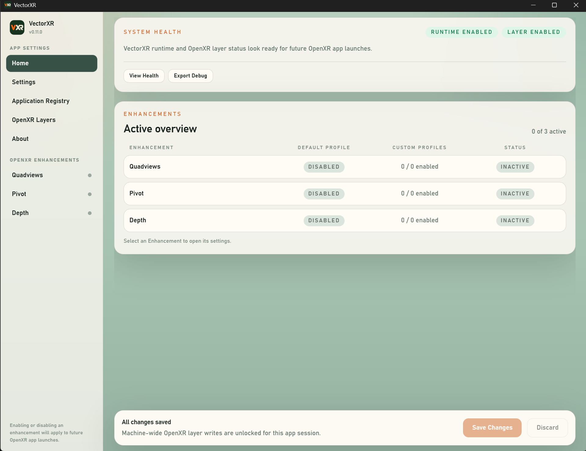
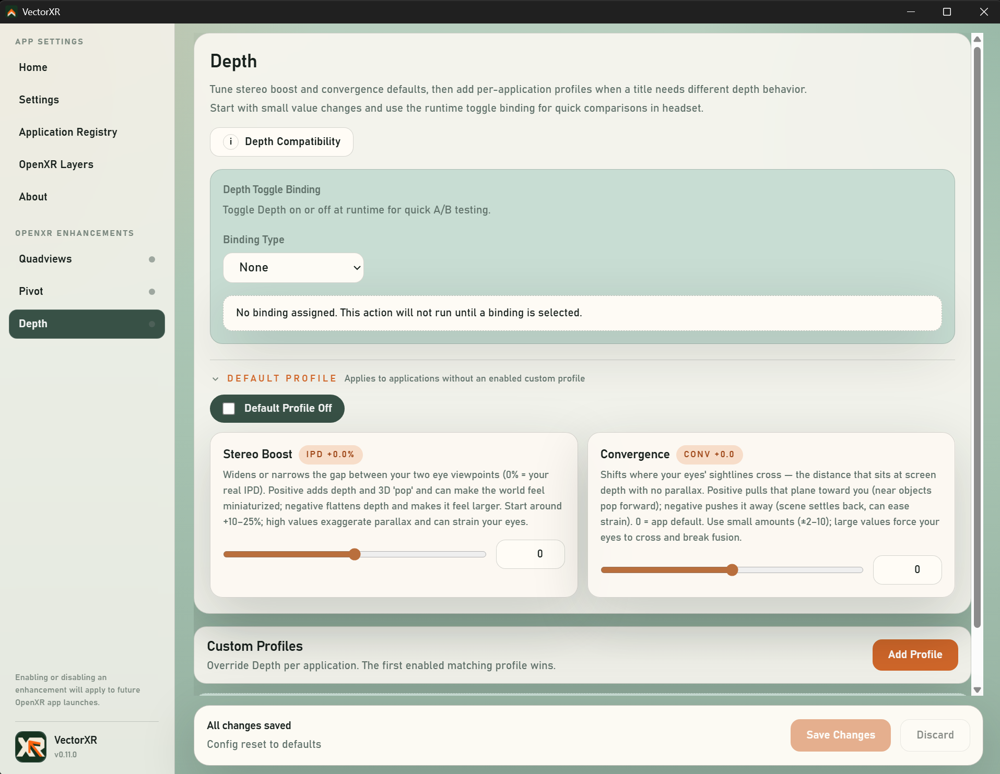
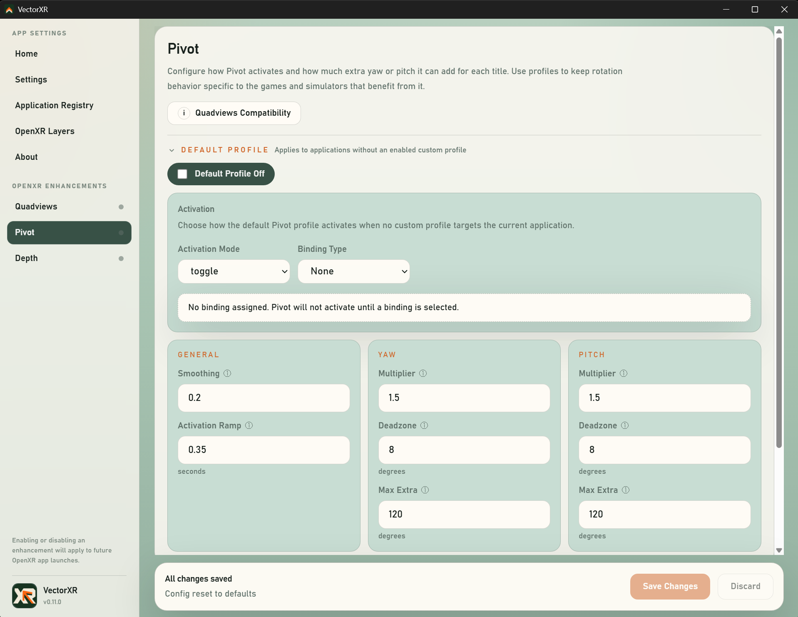
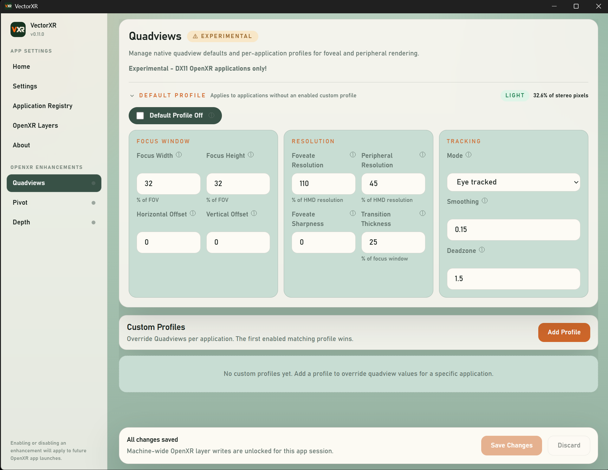
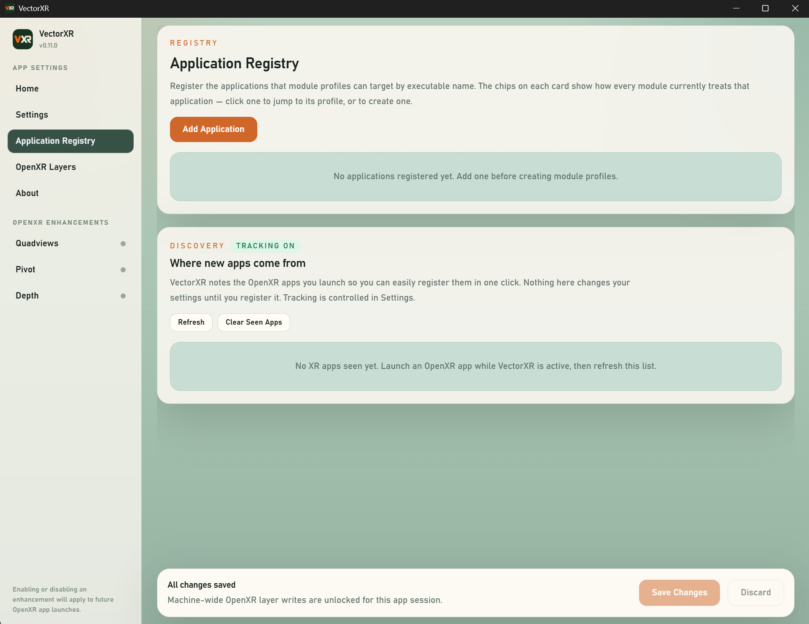
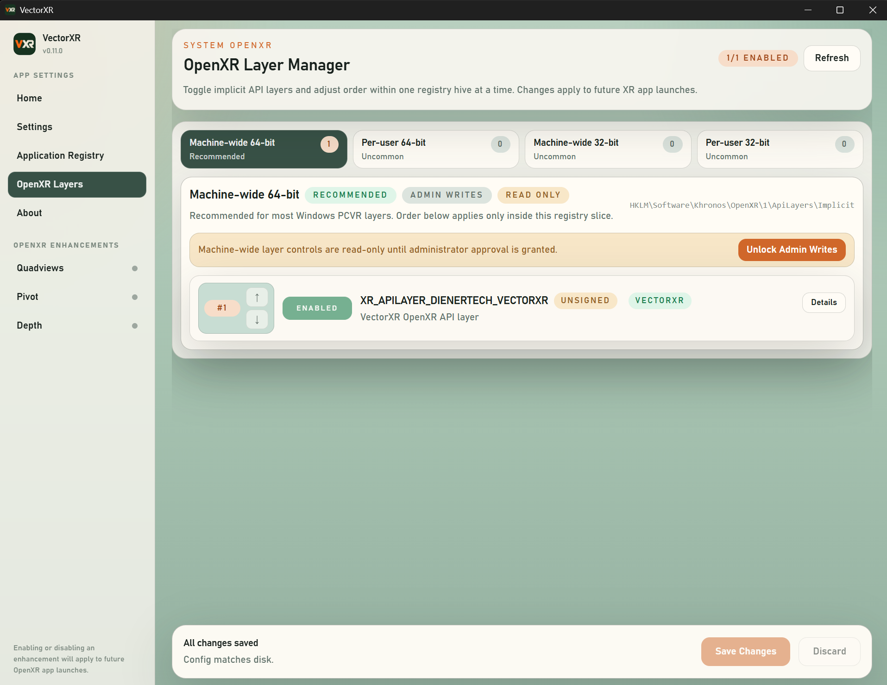
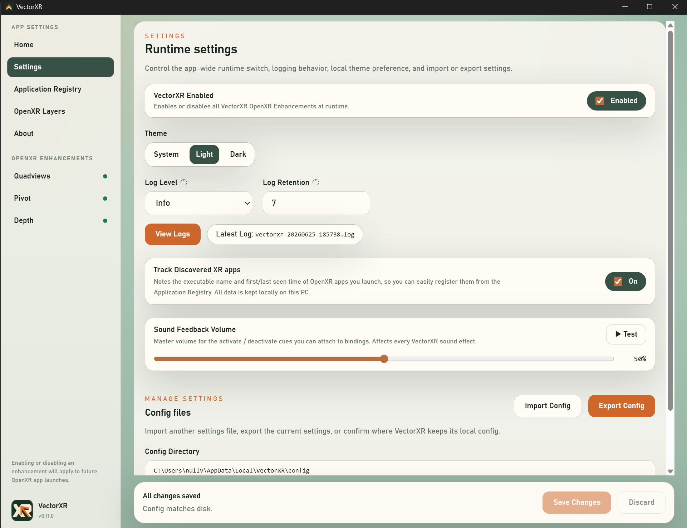
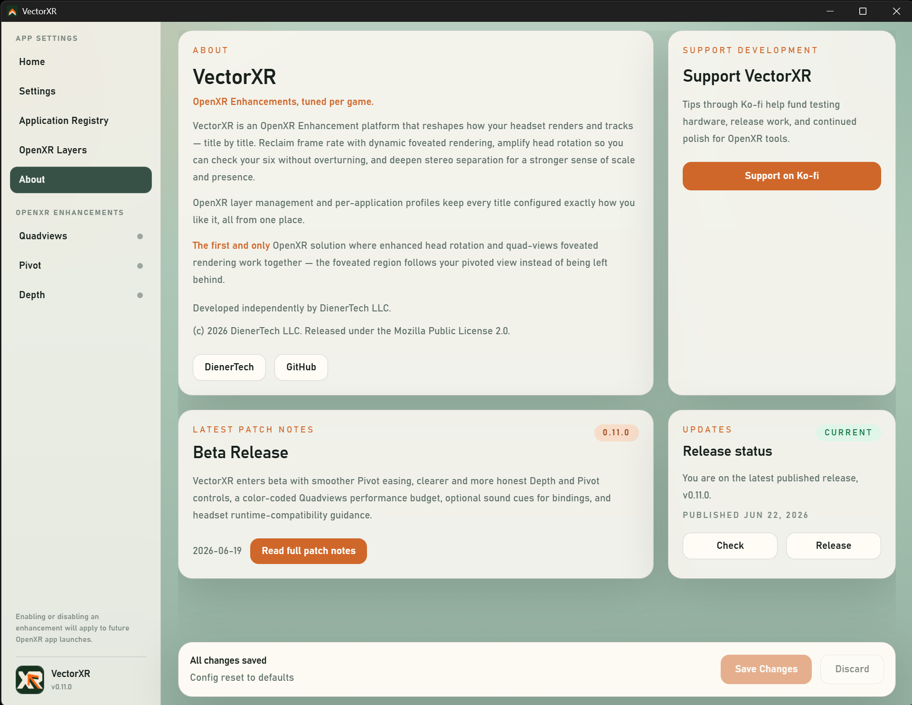
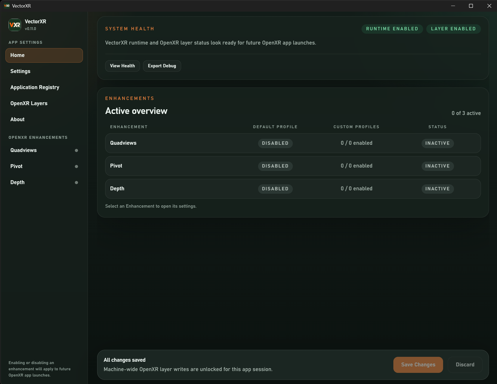

# VectorXR

VectorXR is a Windows desktop app and OpenXR API layer for tuning VR experiences on a per-game basis.

It is built for users who want practical controls for stereo depth, convergence, enhanced head rotation, and OpenXR layer management without hand-editing config files or digging through the Windows registry.

Developed by DienerTech LLC.

## Why VectorXR

**Pivot your foveated view.** When using OpenXR quad-views foveated rendering, VectorXR is the first and only solution that also pivots your head pose so the foveated region follows the rotated view. Foveated rendering exists in a few forms — the Quad-Views-Foveated OpenXR layer, some runtimes, some game engines — and neck-assist tools rotate the view, but no one had combined the two: run as independent OpenXR layers they don't coordinate, so the high-detail foveal region is left behind the moment the view rotates. VectorXR computes Pivot and Quadviews in a single layer with shared runtime state, keeping the foveal region locked to your gaze through the rotation. In DCS — the title that benefits from both at once — they work together cleanly.

## Features

- Tune stereo depth and convergence through the Depth module.
- Configure enhanced yaw and pitch rotation through the Pivot module.
- Drive foveated-style rendering with a visible performance budget through the Quadviews module.
- Create per-application profiles so different OpenXR games can use different settings.
- Track OpenXR apps VectorXR has seen and register them as profile targets.
- Bind feature toggles to keyboard shortcuts or detected input devices.
- Inspect, enable, disable, and reorder installed OpenXR implicit API layers.
- View VectorXR runtime logs from inside the app.
- Check for newer VectorXR releases from the About tab.
- Import, export, reset, and validate local settings.

## Screenshots

### Home



The Home tab is a status dashboard: runtime and layer status, system health, and an Active overview of every Enhancement's default profile, custom profiles, and current state.

### Depth



Depth profiles tune world scale and the convergence plane globally or per application, with a live pairing map, a native-submission Depth Lock, and runtime toggles for quick in-headset A/B comparisons.

### Pivot



Pivot profiles configure enhanced yaw and pitch rotation, activation behavior, smoothing, deadzones, and keyboard or device bindings.

### Quadviews



Quadviews configures foveated-style rendering with a live performance budget that estimates render cost before you launch a game.

### Application Registry



The application registry keeps profile targets organized and can turn discovered OpenXR apps into reusable application entries.

### OpenXR Layers



The OpenXR layer manager inspects installed implicit API layers across the Windows registry slices, shows signature and path status, and can enable, disable, or reorder layers.

### Settings



Settings holds the runtime master switch, theme, logging, discovered-app tracking, and config import/export/reset.

### About And Updates



The About tab includes release status, GitHub update checks, project links, patch notes, and support information.

### Dark Mode



## How It Works

VectorXR has two main pieces:

- A Tauri desktop app for settings, profiles, update checks, logs, and OpenXR layer management.
- A Windows OpenXR API layer that reads those settings and applies runtime adjustments when an OpenXR app is running.

The installer registers the VectorXR API layer with Windows so OpenXR runtimes can load it automatically. Settings are stored locally under `%LOCALAPPDATA%\VectorXR`.

## Usage

For a walkthrough of configuring profiles and each module — Depth, Pivot, Quadviews, the application registry, and OpenXR layer management — see the [usage guide](docs/usage.md).

## Installation

Download the latest Windows installer from the GitHub Releases page:

https://github.com/DienerTech/vectorxr/releases/latest

Run the installer, then launch VectorXR from the Start menu or desktop shortcut.

VectorXR installs its OpenXR API layer machine-wide, so the installer may require administrator permission.

## Updates

The About tab can check GitHub for the latest published VectorXR release and open the release page when a newer build is available.

VectorXR does not currently auto-download or auto-install updates. Updates are installed manually from GitHub Releases.

## Current Status

VectorXR is in **beta**. It is feature-complete for its current scope — the desktop app, Windows installer, OpenXR layer registration, per-application profile model, Depth, Pivot, and Quadviews modules, app discovery, logs, update checks, and the OpenXR layer manager are all implemented and working.

Beta means it is ready to use day-to-day, but it is young and has had limited real-world testing across the range of VR runtimes, hardware, and game-specific VR behavior. Some games expose Force IPD or world-scale controls that can override Stereo Boost; disable those controls before testing Depth. VectorXR is designed to be reversible: you can disable any Enhancement, disable the VectorXR layer, or uninstall entirely if anything misbehaves.

Feedback and bug reports are welcome — that is what this stage is for.

The road to a 1.0 release includes Windows binary code signing (current builds are unsigned, so the installer will show a SmartScreen warning), broader cross-runtime testing, and a few packaging items.

## Build From Source

VectorXR is Windows-focused and expects:

- Visual Studio with Desktop C++ tools
- CMake 3.28+
- Node.js 20+
- Rust toolchain with `cargo`
- Tauri 2 prerequisites for Windows
- Download the OpenXR SDK from [KhronosGroup](https://github.com/KhronosGroup/OpenXR-SDK/releases)
- VectorXR needs either an OpenXR SDK that provides `OpenXRConfig.cmake`, or a local `OpenXR.Loader.*.nupkg` package in the repository root


The local `OpenXR.Loader.*.nupkg` package is intentionally not tracked in source control. The GitHub release workflow restores the pinned NuGet package during CI before building the layer.

Install app dependencies:

```powershell
cd app
npm ci
```

Build the frontend:

```powershell
npm run build
```

Build the production Windows installer:

```powershell
npm run installer:build
```

The installer build compiles the OpenXR layer, stages the layer DLL and manifest for Tauri, and produces an NSIS installer under `app\src-tauri\target\release\bundle\nsis`.

## Release Tags

GitHub builds release installers from `vMAJOR.MINOR.PATCH` tags. First add the release as the first object in `app/src/lib/patchNotes.json`. The release script uses that object as the single source for the date, title, summary, and complete nested change list; it then updates every version location and lock file, generates matching Markdown release notes, validates the result, commits it, creates an annotated tag, atomically pushes the branch and tag, and waits for the GitHub Release workflow:

```powershell
.\scripts\Set-Version.ps1 -Version 0.14.0 -Publish
```

Run the command from a clean branch with working Git credentials and an authenticated GitHub CLI (`gh auth login`). Use `-WhatIf` to preview the operation, or `-NoWait` with `-Publish` to return after the tag is pushed instead of following the workflow. The generated release body is committed at `release/notes/vMAJOR.MINOR.PATCH.md`; `.github/workflows/release.yml` uses it verbatim and uploads the Windows installer plus a SHA-256 checksum.

In-app and GitHub release data lives in `app/src/lib/patchNotes.json`. Author the complete entry there before running `Set-Version.ps1`; nested items are preserved in both the app and generated Markdown:

```json
"items": [
  {
    "html": "<strong>DepthXR</strong>",
    "items": [
      "First DepthXR change.",
      "Second DepthXR change."
    ]
  }
]
```

Patch-note summaries and item text support the attribute-free inline tags `<strong>`, `<em>`, `<code>`, and `<br>`. Lists stay structural JSON rather than raw HTML, and all other markup is escaped by the app renderer.

## Project Layout

- `app/`: Tauri 2 and Vue 3 desktop app
- `layer/`: C++20 OpenXR API layer and runtime logic
- `config/`: shared schema and config notes
- `docs/`: architecture notes, the usage guide, and screenshots
- `examples/`: sample settings
- `scripts/`: Windows build, install, staging, and release helpers

## Acknowledgments

VectorXR exists in the wider OpenXR community, and several open source projects helped shape it.

- [Quad-Views-Foveated](https://github.com/mbucchia/Quad-Views-Foveated) by mbucchia: an OpenXR API layer for quad views and foveated rendering. It has been a major reference point for real-world OpenXR API layer behavior and compatibility concerns.
- [OpenXR API Layers GUI](https://github.com/fredemmott/OpenXR-API-Layers-GUI) by Fred Emmott: a Windows tool for viewing, enabling, disabling, and reordering OpenXR API layers. It directly inspired VectorXR's built-in OpenXR layer management experience.
- [XrNeckSafer](https://gitlab.com/NobiWan/xrnecksafer) by NobiWan: an OpenXR neck-saver utility that helped prove how useful runtime rotation assistance can be for seated VR and flight simulation setups.

Thank you to the maintainers and contributors behind these projects.

## License

The VectorXR source code is released under the Mozilla Public License 2.0 (MPL-2.0). See [LICENSE](LICENSE).

MPL-2.0 is a file-level copyleft license: you are free to use, modify, and redistribute VectorXR, including as part of a larger work that combines it with proprietary code, provided that modifications to the MPL-covered files themselves remain available under the MPL.

VectorXR, the VectorXR name, and VectorXR branding are product identifiers of DienerTech LLC. Consistent with MPL-2.0 section 2.3, the license covers the source code but does not grant rights to use DienerTech LLC trademarks, logos, or branding except to refer to the project.
