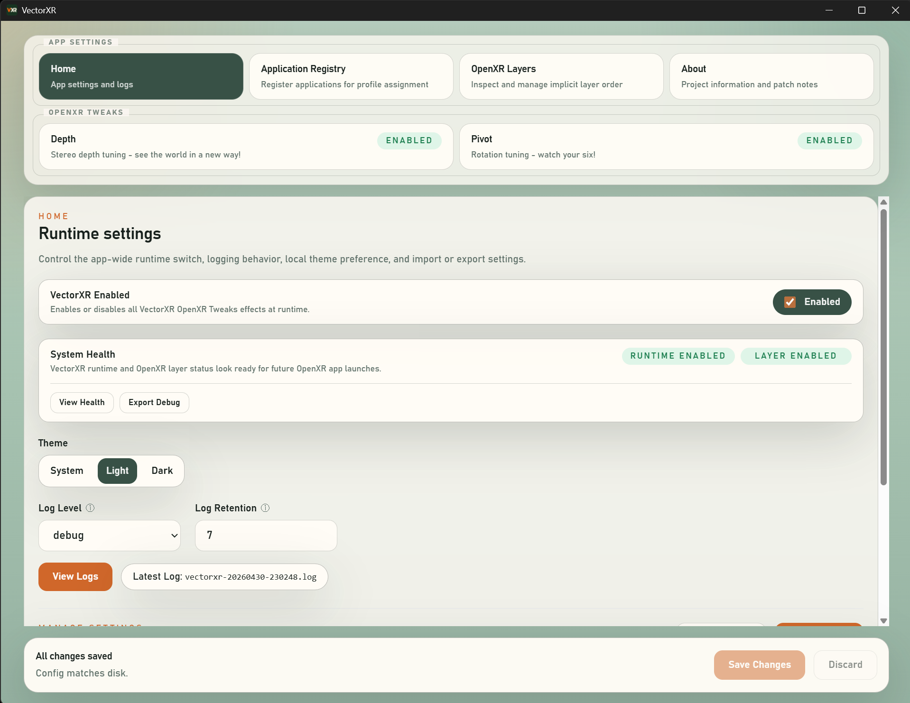
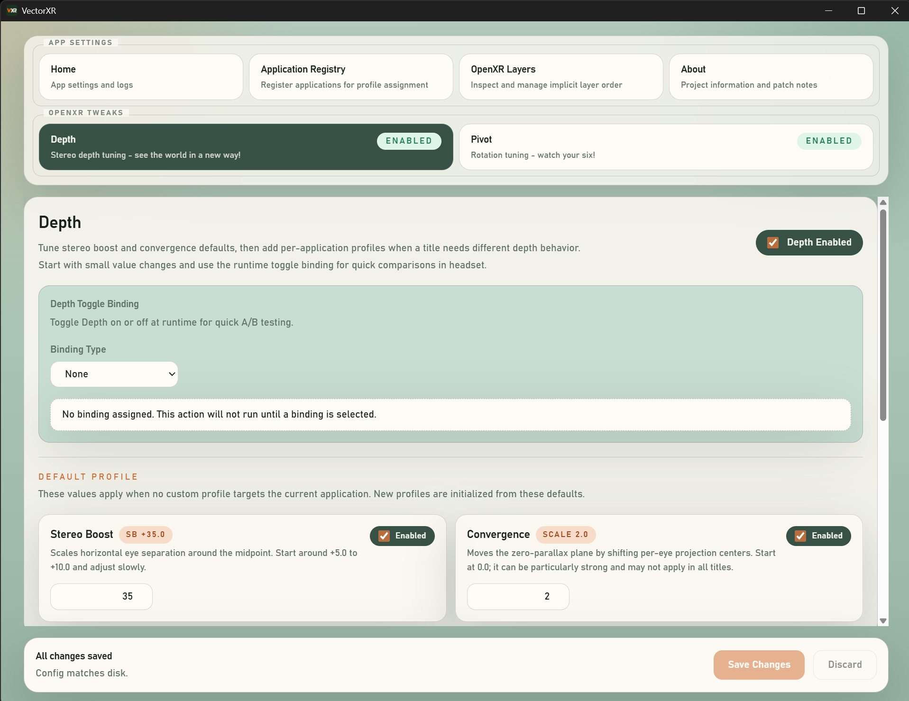
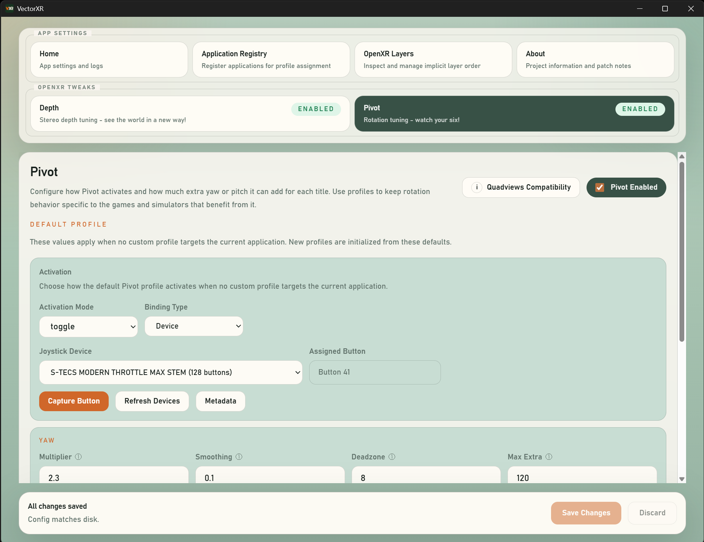
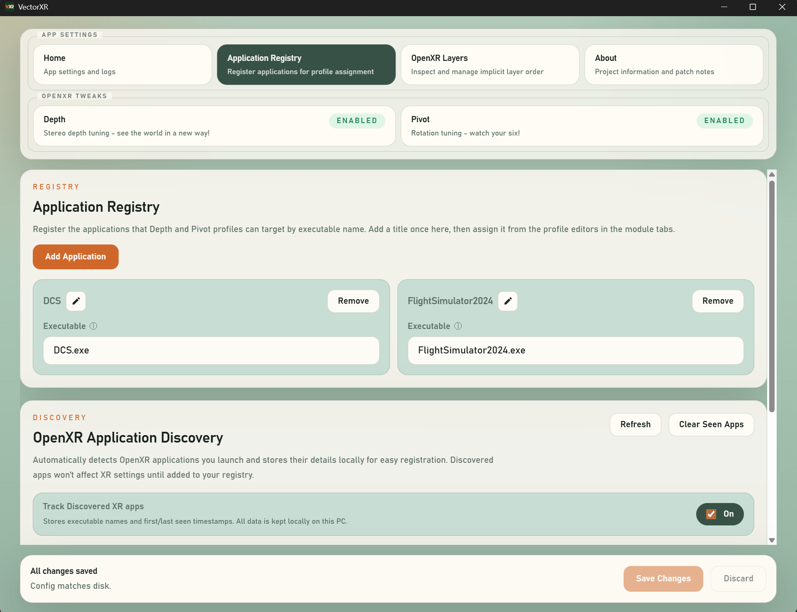
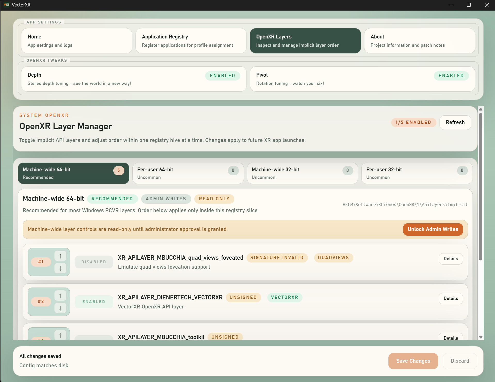
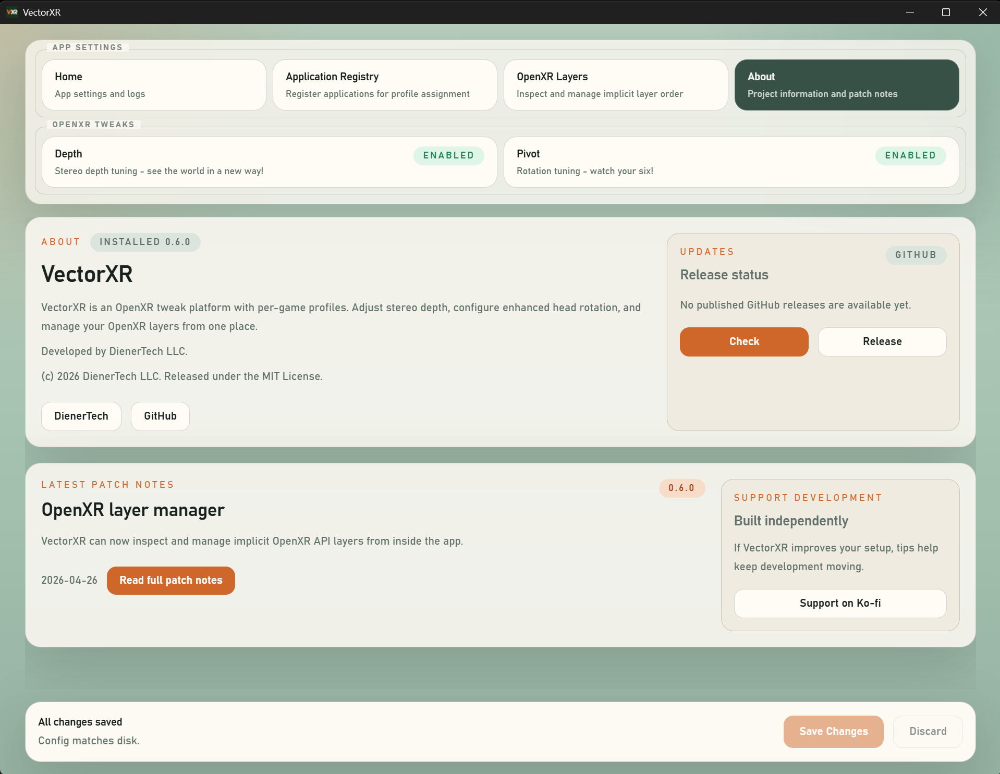
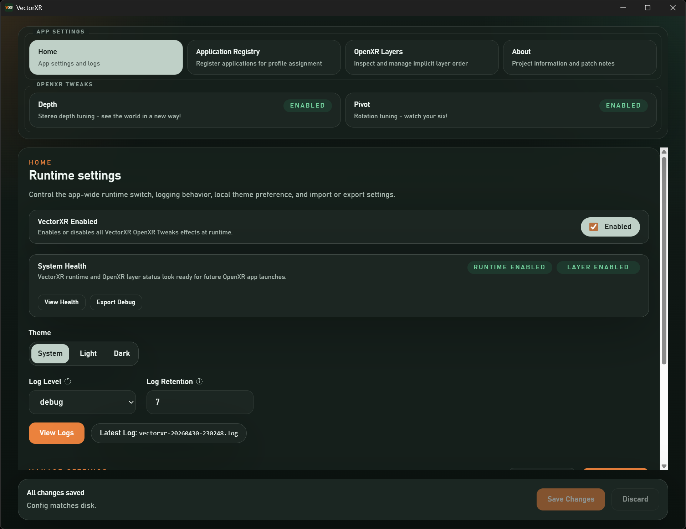

# VectorXR

VectorXR is a Windows desktop app and OpenXR API layer for tuning VR experiences on a per-game basis.

It is built for users who want practical controls for stereo depth, convergence, enhanced head rotation, and OpenXR layer management without hand-editing config files or digging through the Windows registry.

Developed by DienerTech LLC.

## Features

- Tune stereo depth and convergence through the Depth module.
- Configure enhanced yaw and pitch rotation through the Pivot module.
- Create per-application profiles so different OpenXR games can use different settings.
- Track OpenXR apps VectorXR has seen and register them as profile targets.
- Bind feature toggles to keyboard shortcuts or detected input devices.
- Inspect, enable, disable, and reorder installed OpenXR implicit API layers.
- View VectorXR runtime logs from inside the app.
- Check for newer VectorXR releases from the About tab.
- Import, export, reset, and validate local settings.

## Screenshots

### Home



The Home tab shows suite-level settings, app status, log access, theme controls, import/export actions, and the current VectorXR OpenXR layer status.

### Depth



Depth profiles tune stereo boost and convergence globally or per application.

### Pivot



Pivot profiles configure enhanced yaw and pitch rotation, activation behavior, smoothing, deadzones, and device bindings.

### Application Registry



The application registry keeps profile targets organized and can turn discovered OpenXR apps into reusable application entries.

### OpenXR Layers



The OpenXR layer manager inspects installed implicit API layers, shows signature and path status, and can enable, disable, or reorder layers.

### About And Updates



The About tab includes release status, GitHub update checks, project links, patch notes, and support information.

### Dark Mode



## How It Works

VectorXR has two main pieces:

- A Tauri desktop app for settings, profiles, update checks, logs, and OpenXR layer management.
- A Windows OpenXR API layer that reads those settings and applies runtime adjustments when an OpenXR app is running.

The installer registers the VectorXR API layer with Windows so OpenXR runtimes can load it automatically. Settings are stored locally under `%LOCALAPPDATA%\VectorXR`.

## Installation

Download the latest Windows installer from the GitHub Releases page:

https://github.com/DienerTech/vectorxr/releases/latest

Run the installer, then launch VectorXR from the Start menu or desktop shortcut.

VectorXR installs its OpenXR API layer machine-wide, so the installer may require administrator permission.

## Updates

The About tab can check GitHub for the latest published VectorXR release and open the release page when a newer build is available.

VectorXR does not currently auto-download or auto-install updates. Updates are installed manually from GitHub Releases.

## Current Status

VectorXR is approaching an alpha-ready release. The core app, installer, OpenXR layer registration, profile model, Depth module, Pivot module, app discovery, logs, and OpenXR layer manager are implemented.

Planned launch polish includes screenshots, broader testing, release notes, and eventually Windows binary signing for a 1.0 milestone.

## Build From Source

VectorXR is Windows-focused and expects:

- Visual Studio with Desktop C++ tools
- CMake 3.28+
- Node.js 20+
- Rust toolchain with `cargo`
- Tauri 2 prerequisites for Windows
- Either an OpenXR SDK that provides `OpenXRConfig.cmake`, or a local `OpenXR.Loader.*.nupkg` package in the repository root

The local `OpenXR.Loader.*.nupkg` package is intentionally not tracked in source control. The GitHub release workflow restores the pinned NuGet package during CI before building the layer.

Install app dependencies:

```powershell
cd app
npm ci
```

Build the frontend:

```powershell
npm run build
```

Build the production Windows installer:

```powershell
npm run installer:build
```

The installer build compiles the OpenXR layer, stages the layer DLL and manifest for Tauri, and produces an NSIS installer under `app\src-tauri\target\release\bundle\nsis`.

## Release Tags

GitHub builds release installers from `vMAJOR.MINOR.PATCH` tags.

Before tagging, update the version in:

- `app/package.json`
- `app/src-tauri/tauri.conf.json`
- `app/src-tauri/Cargo.toml`
- `app/src/lib/patchNotes.ts`

Then verify and tag:

```powershell
.\scripts\Assert-VersionMatchesTag.ps1 -TagName v0.7.0
git tag v0.7.0
git push origin main --tags
```

Pushing the tag runs `.github/workflows/release.yml`, builds the Windows installer, creates or updates the GitHub Release, and uploads the installer plus a SHA-256 checksum.

## Project Layout

- `app/`: Tauri 2 and Vue 3 desktop app
- `layer/`: C++20 OpenXR API layer and runtime logic
- `config/`: shared schema and config notes
- `docs/`: architecture notes and implementation references
- `examples/`: sample settings
- `scripts/`: Windows build, install, staging, and release helpers

## Acknowledgments

VectorXR exists in the wider OpenXR community, and several open source projects helped shape it.

- [Quad-Views-Foveated](https://github.com/mbucchia/Quad-Views-Foveated) by mbucchia: an OpenXR API layer for quad views and foveated rendering. It has been a major reference point for real-world OpenXR API layer behavior and compatibility concerns.
- [OpenXR API Layers GUI](https://github.com/fredemmott/OpenXR-API-Layers-GUI) by Fred Emmott: a Windows tool for viewing, enabling, disabling, and reordering OpenXR API layers. It directly inspired VectorXR's built-in OpenXR layer management experience.
- [XrNeckSafer](https://gitlab.com/NobiWan/xrnecksafer) by NobiWan: an OpenXR neck-saver utility that helped prove how useful runtime rotation assistance can be for seated VR and flight simulation setups.

Thank you to the maintainers and contributors behind these projects.

## License

The VectorXR source code is released under the MIT License. See [LICENSE](LICENSE).

VectorXR, the VectorXR name, and VectorXR branding are product identifiers of DienerTech LLC. The MIT License covers the source code, but it does not grant rights to use DienerTech LLC trademarks, logos, or branding except to refer to the project.
