# Using VectorXR

This guide walks you through VectorXR from a fresh install to a working per-game setup.
For install steps and the project overview, see the
[README](../README.md).

VectorXR has two parts working together:

- the **desktop app**, where you configure everything, and
- the **OpenXR API layer**, which applies your settings at runtime while a VR app is running.

You do not need to keep the desktop app open for the layer to work — the layer reads the saved
config file directly. Settings are stored locally under `%LOCALAPPDATA%\VectorXR`.

## What you see on first launch

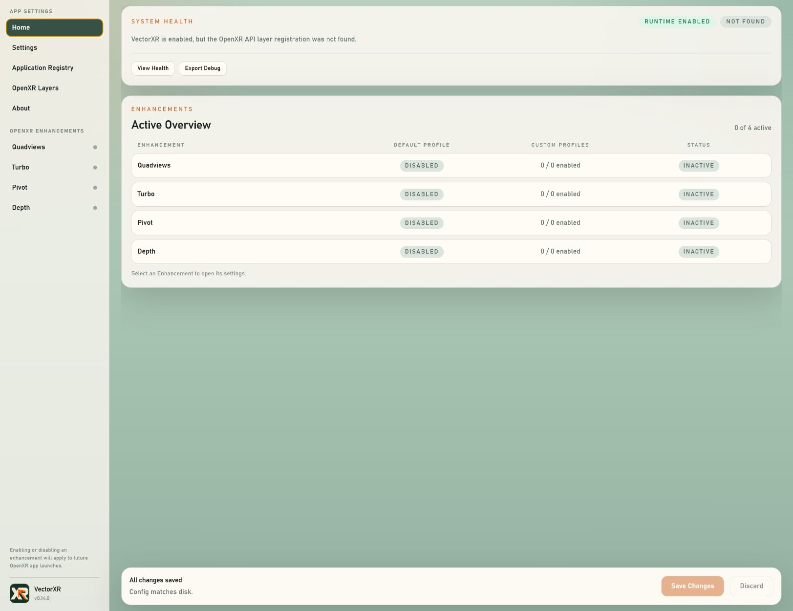

The **Home** tab is a status dashboard:

- **System Health** shows whether the runtime is enabled and the VectorXR layer is registered.
  Use **View Health** for details or **Export Debug** to collect a support ZIP.
- The **Active overview** lists the four Enhancements — **Quadviews**, **Turbo**, **Pivot**, and
  **Depth**, including the default profile and enabled custom-profile counts. These summarize
  your configuration; an Active badge does not mean a VR application is currently running.
- The left sidebar holds app sections (Home, Settings, Application Registry, OpenXR Layers,
  About) and the four Enhancements, each with its own on/off toggle.
- The bar at the bottom is the **save bar**. Changes you make are staged until you click **Save
  Changes** (or **Discard**). Watch this bar — nothing you change takes effect until it's saved.
- **Community & Announcements** provides access to the DienerTech Discord and Ko-fi support.

## How VectorXR decides what to apply

This is the core idea, so it's worth understanding before you start clicking. For each
Enhancement, settings resolve in layers:

1. **Runtime master switch** — *VectorXR Enabled* in **Settings**. If this is off, no
   Enhancement does anything, regardless of profiles. It is on by default.
2. **Default Profile** — one baseline per Enhancement. It *applies to applications without an
   enabled custom profile*. Ships **off**. Turn it on when you want an Enhancement to apply
   broadly to anything you haven't given a specific profile.
3. **Custom Profiles** — each targets one or more registered applications. **The first enabled
   custom profile that matches the running app wins** — it turns that Enhancement on for that
   app and applies its settings, *even if the Default Profile is off*.

So there are two ways to turn an Enhancement on for a game:

- **Default Profile on** → applies everywhere that doesn't have a custom profile (simple, global).
- **A custom profile targeting that game** → applies only to that game, and overrides the default.

If two enabled profiles target the same app, the first enabled one wins, and the app warns you
about the conflict so it is never silent.

## Step 1 — Confirm the runtime is enabled

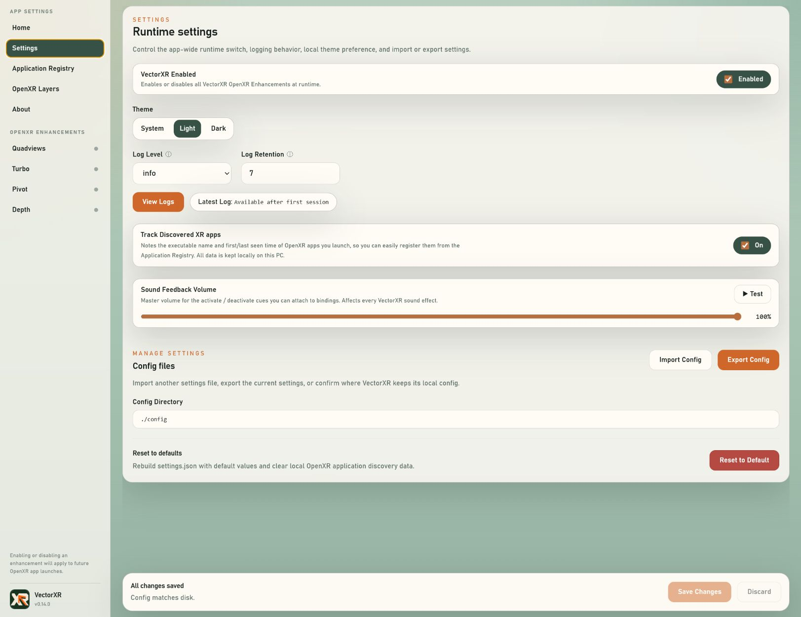

Open **Settings** and check that **VectorXR Enabled** is on (it is by default). This is the
single master switch for all Enhancements at runtime.

While you're here:

- **Track Discovered XR apps** is on by default. It records the executable name of OpenXR apps
  you launch so you can register them in one click later (see Step 2). All data stays local.
- Set your **theme** (System / Light / Dark), **log level**, and **log retention**.
- **Import / Export Config** moves your full configuration between machines or backs it up, and
  **Reset to Default** rebuilds the config and clears discovery data.

## Step 2 — Register the app you want to tune

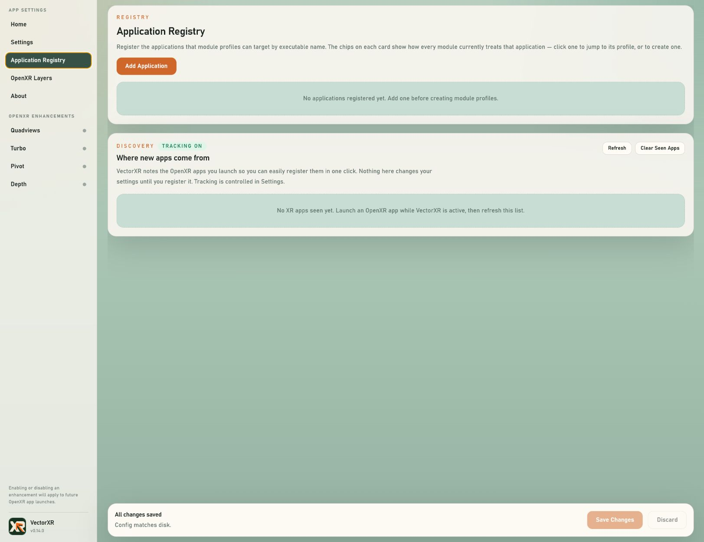

Custom profiles target apps by executable name, so first register the app in the **Application
Registry**. On first run it's empty ("No applications registered yet").

Two ways to add one:

- **Add Application** — enter the app manually (name + executable, e.g. `DCS.exe`).
- **From discovery (recommended)** — the **Where new apps come from** panel lists OpenXR apps
  VectorXR has *seen*. Launch your VR app once while VectorXR is active, come back, click
  **Refresh**, and register it in one click — no need to guess the executable name. Nothing here
  changes your settings until you actually register an app.

## Step 3 — Turn on an Enhancement

Open an Enhancement from the sidebar. Each one has the same shape: a **Default Profile** at the
top and a **Custom Profiles** list below. To apply it to the app you just registered, click
**Add Profile**, point the profile at that application, tune the values, and save. To apply it
broadly instead, just turn the **Default Profile** on.

The four Enhancements:

### Depth

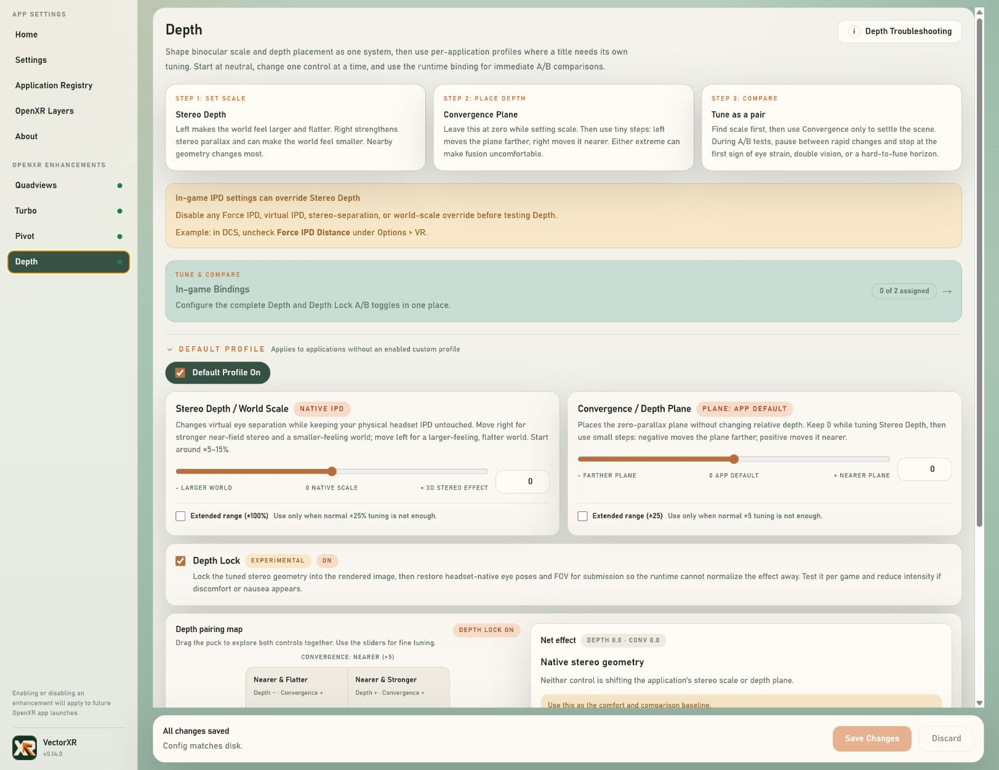

Depth adjusts virtual eye separation and projection convergence as one binocular system. Stereo
Depth controls perceived world scale; Convergence places the zero-parallax depth plane.

- Begin with **Convergence at 0**. Move **Stereo Depth / World Scale** left to increase apparent
  scale when a cockpit feels miniaturized, or right for stronger stereo shape and a more compact
  world. Nearby geometry changes more visibly than the horizon. The normal range is ±25%; enable
  its explicit extended range only when you intentionally need the full ±100%.
- Once scale feels right, adjust **Convergence / Depth Plane** in small 0.1–0.5 steps. Negative
  moves the plane farther away; positive moves it nearer. The normal control is limited to ±5 for
  comfort. Enable the explicit extended range only for an existing profile or careful testing.
- **Depth Lock** preserves the tuned stereo image by restoring headset-native geometry when the
  projection layer is submitted, preventing the runtime from normalizing much of the pairing away.
  Compare it on and off at identical slider values; reduce intensity or disable it if comfort worsens.
- The live **Depth Pairing Map** shows which of the four Stereo Depth/Convergence combinations is
  active and explains both its benefit and comfort tradeoff. Negative Stereo Depth with negative
  Convergence can create a larger, more relaxed cockpit that better matches real-world proportions;
  positive Depth with negative Convergence keeps stronger stereo shape while giving it room;
  negative Depth with positive Convergence combines larger scale with a near working plane; and two
  positive values create the most compact, immediate presentation.
- Treat per-game profiles as independent calibrations. Different titles may need different
  quadrants—not merely small variations of one universal setting.
- The **Depth Toggle Binding** at the top lets you toggle Depth on/off at runtime for quick A/B
  comparisons in headset.
- Games with a **Force IPD**, virtual-IPD, stereo-separation, or
  world-scale setting can override Stereo Boost; disable that setting before testing Depth.
  In DCS, uncheck **Force IPD Distance** under **Options > VR**, fully restart DCS, and open
  **Depth Troubleshooting** for additional guidance if Stereo Boost still seems inactive.

### Pivot

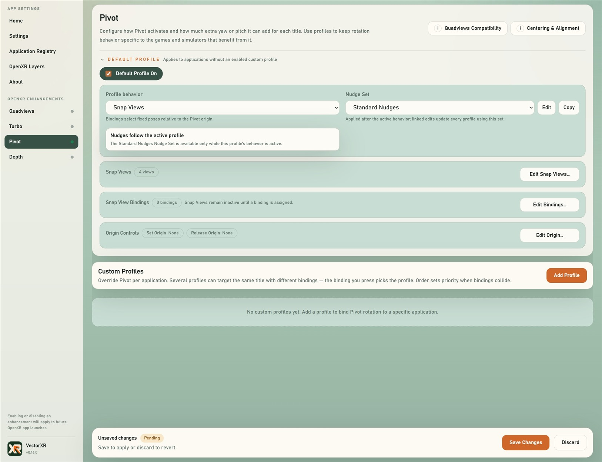

Pivot enhances head rotation for seated and flight-sim VR, letting you see further to the side or
up/down than your physical neck allows.

- Choose a **Profile behavior** for each enabled profile. **Enhanced Motion** amplifies natural
  head rotation with Continuous or Stepped response tuning. **Snap Views** uses bindings to select
  named, fixed poses relative to the captured Pivot origin.
- For **Enhanced Motion**, open **Activation** and choose an activation mode. *Toggle* and *Hold*
  require a keyboard, joystick, or HOTAS binding. *Always On* engages automatically; an optional
  activation binding suspends and resumes that automatic engagement.
- Every Pivot action accepts multiple bindings, so keyboard chords and device inputs can be mixed.
  **Origin Controls** has its own category: **Set Origin** captures the current head pose as the
  neutral seated origin; assigning it to the same input as the simulator's recenter action keeps
  both origins aligned. **Release Origin** clears that captured origin. Set Origin and Release
  Origin can each have multiple bindings too.
- Select a **Nudge Set** to layer reusable fixed-step yaw and pitch adjustments after the profile's
  main behavior. A linked set can be shared by several profiles, while **Copy** creates an
  independent starting point for different bindings or step sizes.
- Choose **Continuous** response for multiplier-based motion, then tune **Yaw** and **Pitch**
  independently with rotation **Multiplier**, **Deadzone**, and **Max Extra** degrees. A shared
  **Smoothing** value softens continuous motion.
- Choose **Stepped** response to add fixed rotation at angle thresholds. Yaw and pitch each have
  independent **Deadzone**, **Step Trigger**, **Step Amount**, **Hysteresis**, and **Max Extra**
  controls. **Instant** transitions land directly on each step; **Glide** uses one bounded,
  fixed-duration transition that settles without overshoot.
- **Advanced axes** can tune left, right, up, and down independently. Continuous and Stepped keep
  separate directional values, so switching response modes does not discard either setup.
- The **Activation Ramp** (default 0.35s) eases Pivot in and out when it engages or disengages
  rather than snapping the view.

#### Setting up Snap Views

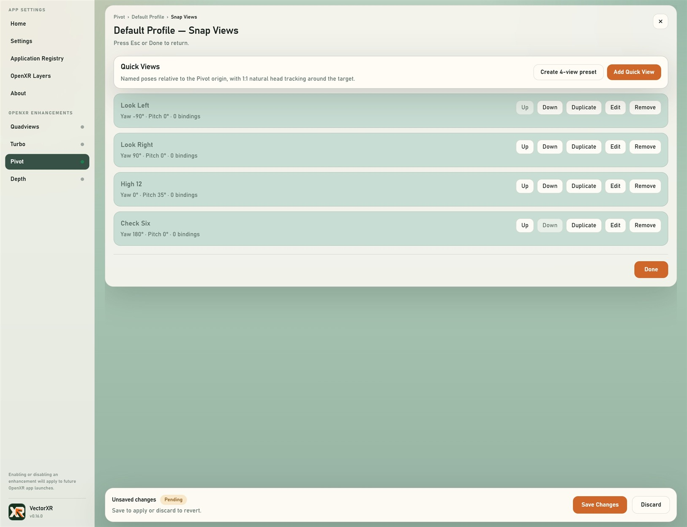

1. Enable the default Pivot profile, or add and enable a custom application profile.
2. Set **Profile behavior** to **Snap Views**, then choose **Edit Snap Views**.
3. Select **Create 4-view preset** for Look Left, Look Right, High 12, and Check Six, or use
   **Add Quick View** to build your own list.
4. Edit each view to set yaw, pitch, transition time, and optional right/left, up/down, and
   forward/back position offsets. Negative yaw turns left; positive yaw turns right.
5. Add at least one binding to every view you want to use. **Hold** returns when released;
   **Toggle** stays active until pressed again or another Snap View takes over.
6. Configure **Set Origin** under Origin Controls and align it with the simulator's recenter action.
   Snap View poses and position offsets are measured from that captured origin.
7. Save the configuration, enter VR, set the origin, and test the views from a comfortable seated
   posture. Reorder the list when binding priority or presentation order needs to be clearer.

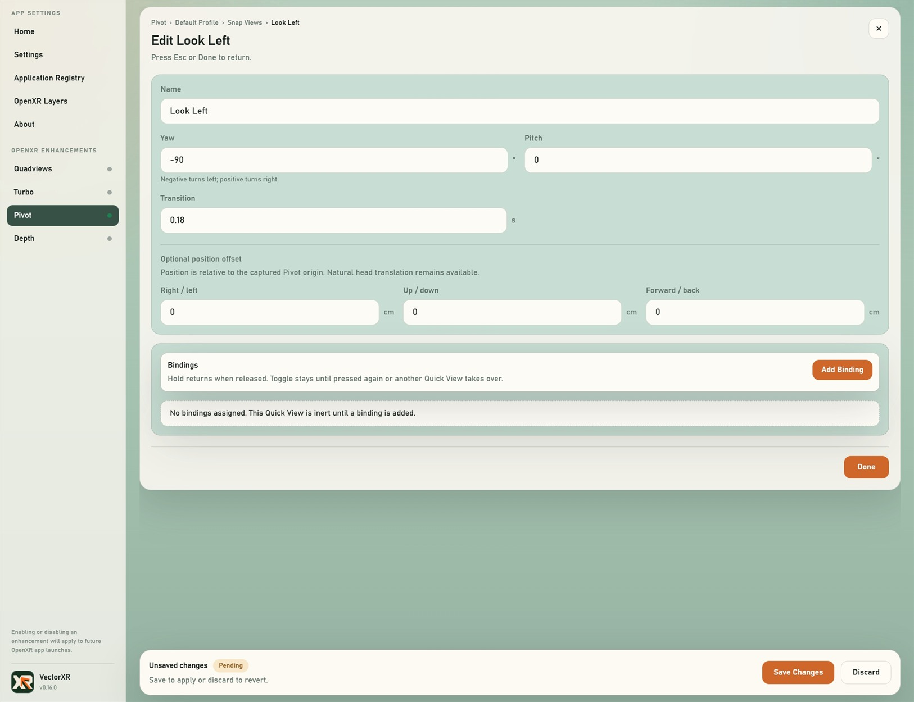

Snap Views keep natural head rotation and translation at 1:1 around the selected pose; they do not
lock the headset. A Snap View temporarily replaces Enhanced Motion and the accumulated nudge offset.
Leaving the view returns smoothly to the underlying state. A view with no binding is inert.

#### Setting up Nudges

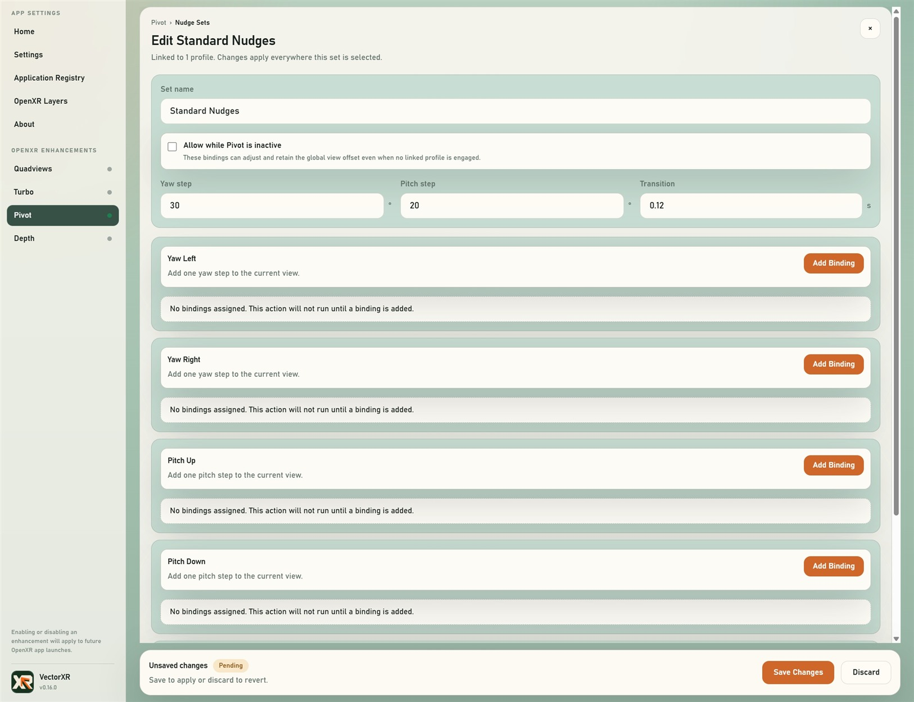

1. Select **Standard Nudges** in the profile's **Nudge Set** menu, or choose **Copy** when the
   profile needs its own steps or bindings.
2. Choose **Edit**, set the yaw step, pitch step, and transition duration, then add bindings for
   Yaw Left, Yaw Right, Pitch Up, Pitch Down, and Center Nudge Offset.
3. Leave **Allow while Pivot is inactive** off when nudges should follow the linked profile. Turn it
   on when those bindings should maintain a global view offset even with no linked profile engaged.
4. Save and test. Directional presses accumulate and oppose one another; **Center Nudge Offset**
   clears the accumulated yaw and pitch. Offsets are limited to ±180° yaw and ±85° pitch.

Editing a shared Nudge Set updates every profile linked to it. Nudges are applied after Enhanced
Motion, but a selected Snap View temporarily takes priority over the accumulated offset.

### Pivot FAQ

**Why does my Snap View do nothing?**

Enable the containing profile, give the view at least one binding, save, and confirm that the
profile targets the running application. Capture an origin before relying on position offsets.

**Should I use Hold or Toggle?**

Use **Hold** for a temporary glance that returns as soon as the control is released. Use **Toggle**
when you want to stay in the view hands-free; press it again or select another Snap View to leave.

**Does a Snap View lock my head?**

No. It moves the origin-relative target while preserving 1:1 natural head motion around it.

**Why do nudges stop when Pivot disengages?**

That is the default safety behavior. Edit the Nudge Set and enable **Allow while Pivot is inactive**
if its bindings should adjust and retain the global offset without an active linked profile.

**Should profiles share a Nudge Set?**

Share one when the same step sizes and bindings should apply everywhere. Use **Copy** before editing
when a profile needs independent controls; linked edits intentionally affect every user of a set.
Pivot and Quadviews are built to work together: because VectorXR computes both in one layer, the
foveated focus region stays locked to your gaze even while Pivot rotates your view. This
combination is VectorXR's signature capability — see [Why VectorXR](../README.md#why-vectorxr).

### Quadviews

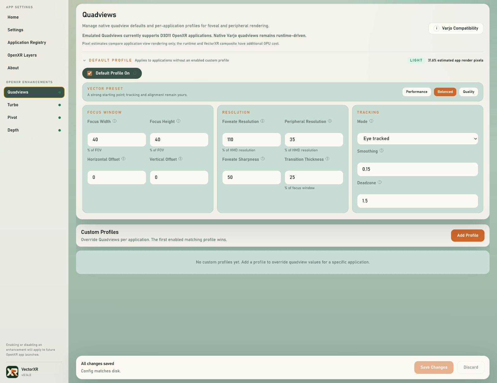

Quadviews drives foveated-style rendering, concentrating detail where you are looking. It is
marked **Experimental** and currently targets **D3D11 quadview-capable apps**. Enabling the
VectorXR module does not make an ordinary stereo game render four views: the game must request
OpenXR quad-view rendering first. DCS is the primary tested title. Other D3D11 games may work
only if they implement the same functionality; compatibility is not implied by D3D11 alone.
Likely, but unconfirmed, candidates include **Pavlov VR**, **VAIL VR**, **The 7th Guest VR**,
and **Kayak VR: Mirage**.

For the recommended **DCS + synthesized VectorXR Quadviews** path, set:

- **DCS > Options > VR > Use Quad View:** on.
- **DCS > Options > VR > Use Eye Tracking:** on for gaze-tracked focus; otherwise VectorXR can
  use head/static focus.
- **VectorXR OpenXR layer:** enabled, with a Quadviews default or DCS profile enabled and saved.
- **Pimax runtime quadviews:** off. In Pimax Play or Pimax EVO, turn **Native Pimax Quad Views**
  off so VectorXR can provide Quadviews and keep the focus region aligned with Pivot. Native Varjo
  Quadviews is different and remains runtime-driven.
- **`XR_APILAYER_MBUCCHIA_quad_views_foveated`:** disabled while VectorXR is the quadviews
  provider. Run one quadviews provider at a time.

Restart DCS after changing its VR settings, the active OpenXR runtime, or API-layer state.

#### Live tuning and restarts

- **Fully live:** Horizontal Offset, Vertical Offset, Tracking Mode, Smoothing, Deadzone,
  Eye Tracking Correction, Foveate Sharpness, and Transition Thickness.
- **Restart required for complete effect:** Focus Width, Focus Height, Focus Resolution,
  Peripheral Resolution, and turning Quadviews or a Quadviews profile on or off. Width and height
  move the visible focus window immediately, but DCS keeps its existing texture dimensions and
  pixel workload until restart. Focus Resolution also keeps DCS's existing focus textures;
  values above 100% may resize VectorXR's output canvas and cause a temporary frame-rate hitch.

VectorXR now defers Quadviews enable/disable changes while an OpenXR session is active. Saving is
safe, but the running game keeps its launch-time state until it exits.

- **Focus Window** sets the size and offset of the high-detail region; **Resolution** sets
  **Foveate** (inner) and **Peripheral** (outer) resolution as a percentage of your headset's
  resolution (100% = headset default).
- The budget indicator at the top right estimates render cost *before* you launch — it reads as a
  **% of stereo pixels** and is color-coded, with a "Detrimental" warning when you exceed budget.
  Watch it while tuning to keep performance positive.
- **Tracking** controls eye-tracked focus (mode, smoothing, deadzone). Quadviews also depends on
  the headset runtime exposing eye-gaze support. If it does not, VectorXR falls back to
  head/static focus.

#### Eye-tracking correction and dimensions

Leave **Eye Tracking Correction** on **Default** when gaze follows your eyes correctly.
Try **Flip Z Only** if the focus region moves backwards on your setup. Save the change and
check gaze direction in the diagnostic visualization before tuning offsets or smoothing.

While a Quadviews game is running, hover the **Dimensions** indicator beside estimated
savings to see submitted peripheral and focus resolutions and allocated texture sizes.
These readings describe the current session, not previous runs or unsaved settings.
Resolution changes may require a game restart before the measured sizes change.

#### Diagnostic visualization

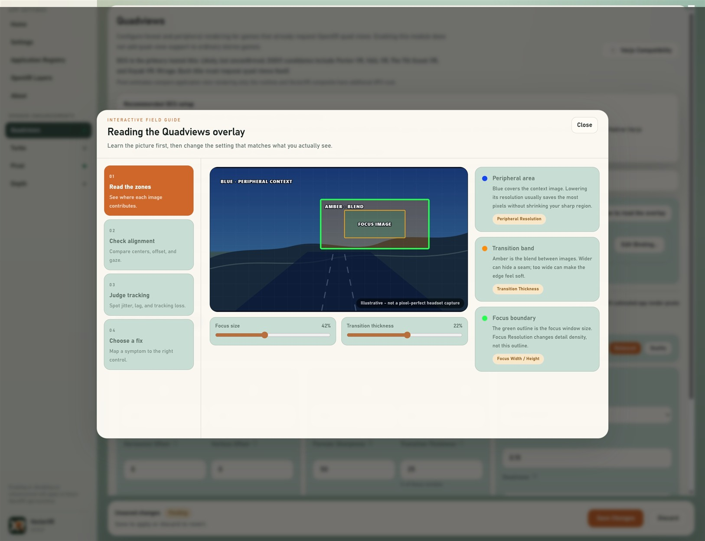

The **In-headset diagnostics** card provides two ways to control the calibration view:

- Assign an **In-headset shortcut** and press it in-game to toggle the visualization.
- While a synthesized Quadviews session is active, use **Show visualization** or **Hide
  visualization** in the VectorXR app for live control. **No active synthesized Quadviews session**
  means there is not currently a compatible session for the app to control.

The visualization starts hidden each OpenXR session. Select **How to read the overlay** for an
interactive field guide that maps the picture and common symptoms to the relevant settings. The
in-headset view labels the rendered regions and tracking pipeline with color:

- Blue tint: peripheral image; amber tint: blended transition band.
- Green focus outline: focus window with tracking available; red: eye tracking unavailable and
  VectorXR is holding or returning from the last valid gaze.
- White cross: head-forward center; magenta ring: configured horizontal/vertical offset.
- Cyan ring: raw eye gaze; yellow cross: gaze after deadzone and smoothing.

The diagnostic view is available only for VectorXR's synthesized D3D11 Quadviews compositor. It is
not currently supported on Varjo headsets, where the Varjo runtime owns native composition.

Quadviews and Pivot are designed to compose: unlike running separate foveation and neck-assist
layers, VectorXR keeps the foveated focus region aligned with your gaze while Pivot rotates the
view. See [Why VectorXR](../README.md#why-vectorxr).

### Quadviews FAQ

**Can Quadviews improve any OpenXR game?**

No. The game must request quad-view rendering. DCS is the main tested example. VectorXR's
synthesized path also requires D3D11; a D3D11 renderer by itself is not enough.

**Which quadviews provider should I enable?**

Choose one software provider. For synthesized VectorXR Quadviews, disable Quad-Views-Foveated;
on Pimax, also disable Native Pimax Quad Views. Native Varjo Quadviews remains runtime-driven. If
you deliberately use Quad-Views-Foveated instead, leave the VectorXR Quadviews profile off;
VectorXR can remain enabled for Pivot or Depth, with Quad-Views-Foveated ordered above it.

**Why is the focus region following my head instead of my eyes?**

Turn on **Use Eye Tracking** in DCS and eye tracking in the headset software. The active OpenXR
runtime must expose eye-gaze data to the layer; otherwise head/static focus is the safe fallback.

**Why does eye-tracked focus move backwards?**

Try **Eye Tracking Correction → Flip Z Only** in the matching Quadviews profile.
This changes how backwards-facing driver gaze rays are corrected. **Default**
preserves the existing behavior; leave it selected when gaze movement is correct.

**Why did a saved setting appear to do nothing?**

Confirm that the game has Quad Views enabled, the correct VectorXR profile matches its executable,
and only one provider is active. Check whether the control is marked **Restart required**.
API-layer, runtime, and in-game VR changes also require a full game restart.

**Why is Show visualization unavailable?**

Live app control requires an active VectorXR synthesized D3D11 Quadviews session. Start a compatible
quad-view application with the VectorXR profile enabled. Native Varjo composition does not expose
this visualization; the saved in-headset shortcut also begins each new session with the overlay off.
**What else should I disable while troubleshooting?**

Avoid overlapping features: DCS **Force IPD Distance** can mask Depth, another tool's Turbo mode
can conflict with VectorXR Turbo, and runtime-native quadviews such as Pimax's does not currently compose with Pivot.
Re-enable extras one at a time after the base setup works.

### Turbo

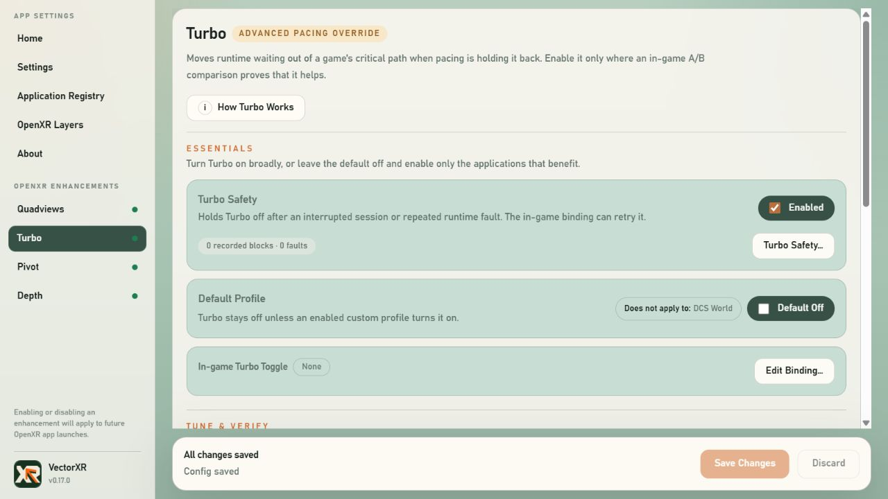

Turbo is an opt-in frame-pacing override for games whose main thread is being held back by the
OpenXR runtime's wait behavior. It is compatibility-sensitive, so keep the default profile off
and enable it only for applications where an in-headset A/B comparison demonstrates a benefit.

#### Set up Turbo for a game

1. Register the game's executable in **Application Registry**.
2. On **Turbo**, leave **Default Profile** off and add an enabled **Custom Profile** for
   that application. Default On applies Turbo to applications without a custom profile.
3. Keep **Turbo Safety** enabled. Open **Runtime Behavior** and leave **Mode** on
   **Auto (recommended)**.
4. Use **In-game Turbo Toggle > Edit Binding…** to assign a keyboard or controller control,
   then click **Save Changes**. The binding works only where Turbo is enabled in the
   application's profile; it can also retry after a safety block or suspension.
5. Launch the game and compare Turbo on/off in the same scene. Use **Performance Diagnostics**
   to compare FPS, frame times, and pacing waits alongside what you see in the headset.

Do not combine VectorXR Turbo with another pacing override such as OpenXR Toolkit Turbo Mode.
Turn Turbo off if you see a Waiting overlay, black frames, persistent stutter, or broken
reprojection. A mid-session toggle can briefly hitch while timing resynchronizes.

#### Runtime Behavior

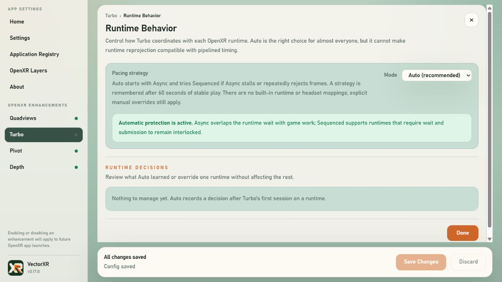

**Auto** starts with **Async**, which overlaps the runtime wait with game work. If Async
stalls or repeatedly rejects frames, Auto tries **Sequenced**, which supports runtimes
that need waiting and submission to remain together. A strategy is remembered after
**60 seconds of stable play**. There are no built-in runtime/headset strategy mappings.

**Runtime Decisions** shows learned results and per-runtime overrides. Leave overrides
on Auto for discovery; forced Async or Sequenced and manual runtime pins take precedence.
A full strategy retest needs a relaunch in Auto without a manual override. An established
Sequenced session keeps that strategy until relaunch even if you change the setting.

#### SteamVR activation in 0.17

The previous VectorXR activation restriction for **DCS + SteamVR + synthesized Quadviews**
has been removed. This setup can now engage Turbo and use the same Auto strategy selection
and Safety controls as other setups.

This removes an application/runtime restriction, not a runtime-enforced FPS cap. Turbo
still depends on the game, headset, driver, and runtime. Disable **SteamVR Motion Smoothing**
when testing and compare both frame times and presentation. Other reprojection systems,
including ASW, may also conflict with Turbo's timing.

#### Turbo Safety

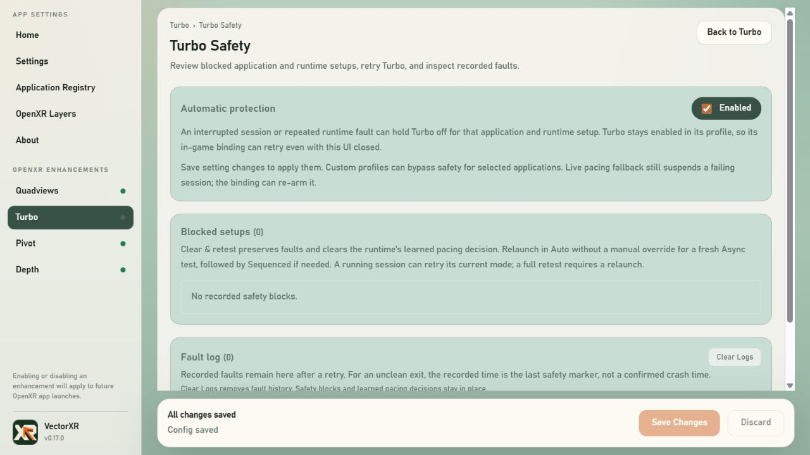

Open **Turbo Safety…** from the Turbo page. The **Enabled/Disabled** switch appears both
there and under **Automatic protection** on the Safety page; both edit the same global
setting. Protection is enabled by default. Click **Save Changes** after changing it.

An interrupted session or repeated runtime fault can hold Turbo off for the same application
and runtime setup, including its headset and graphics configuration. Turbo remains enabled
in the profile so the in-game binding can retry it. A forced exit or unrelated crash can
also leave an interrupted-session record; a block does not prove Turbo caused a crash.

The page shows live Turbo status when a game is running, **Blocked setups**, and a separate
**Fault log**. The overview's block/fault counts describe recorded history, not whether Turbo
is currently rendering frames. A block marked **Bypassed** is retained but is not enforced
by the saved global or per-profile Safety settings.

| Control | What it changes |
| --- | --- |
| In-game Turbo toggle | Retries Turbo for the running application after a block or suspension. A full strategy retest still requires relaunching. |
| **Details** | Opens the fault reason, recorded time, pacing mode, runtime, headset, graphics API, and process ID where available. |
| **Clear & retest** | Clears the selected setup's block and its runtime's learned pacing decision, while retaining fault history. Relaunch in Auto without a manual override to test Async and then Sequenced if needed. |
| **Clear Logs** | Removes recorded fault history. It does **not** clear safety blocks or learned pacing decisions. The button is disabled when there are no faults. |
| Global **Turbo Safety: Disabled** | Bypasses persistent protection, including previous blocks. Live pacing fallback can still suspend a failing session. Save to apply. |

Retry only after the session is stable. If the game is stuck, close and relaunch it;
Safety cannot unblock a driver call already in flight.

#### Per-application Safety override

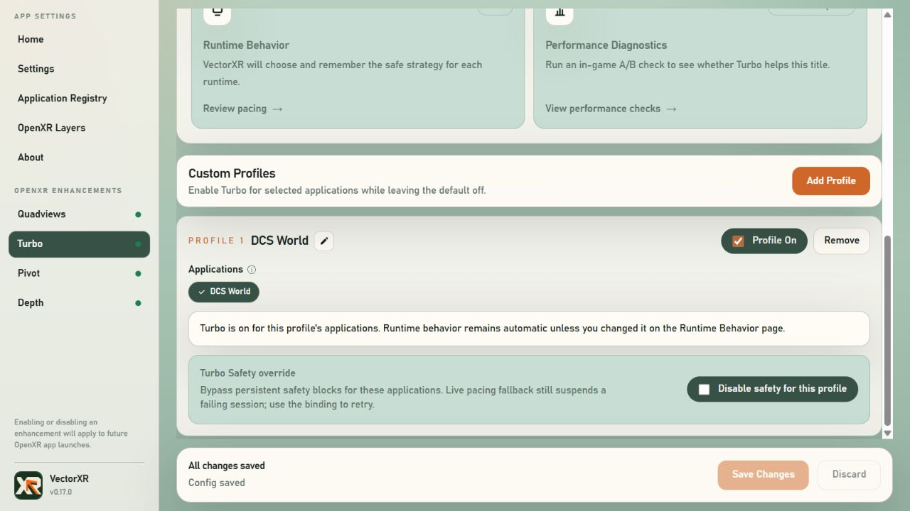

For an application-specific exception, open its custom Turbo profile and check
**Turbo Safety override > Disable safety for this profile**, then **Save Changes**.
Leave this unchecked to use the global protection setting. The bypass applies only to
that profile's applications; it does not turn off live pacing fallback or delete history.
The screenshot shows an example DCS profile with protection retained.

#### Fault logs and support exports

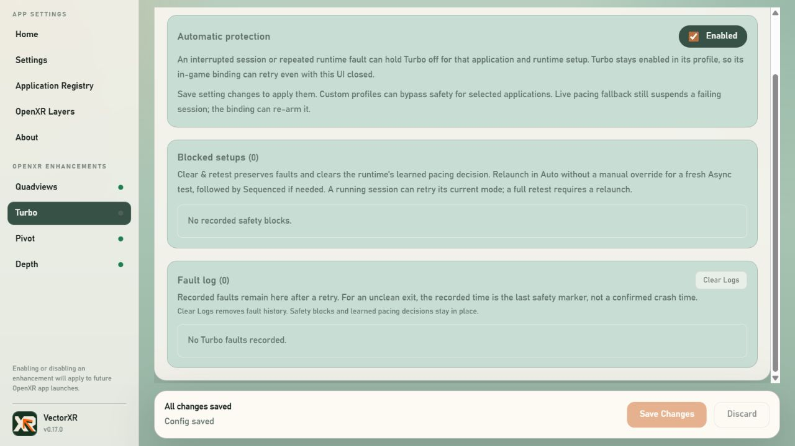

Faults remain available after a retry. For an unclean exit, the recorded timestamp is the
last Safety marker, not a confirmed crash time. The screenshots show an empty history;
recorded faults add rows with **Details** controls.

Before clearing logs, use **Home > Export Debug** to save an **Export Debug Information** ZIP
when reporting a problem. It includes Turbo metrics, pacing decisions, safety records,
live and saved runtime diagnostics, current and saved settings, and retained VectorXR logs.
Raw capture is limited to 8 MiB per file and 64 MiB total; the ZIP inventory lists any
unavailable or limited files. Review the ZIP for private information before sharing it.

## OpenXR layer management

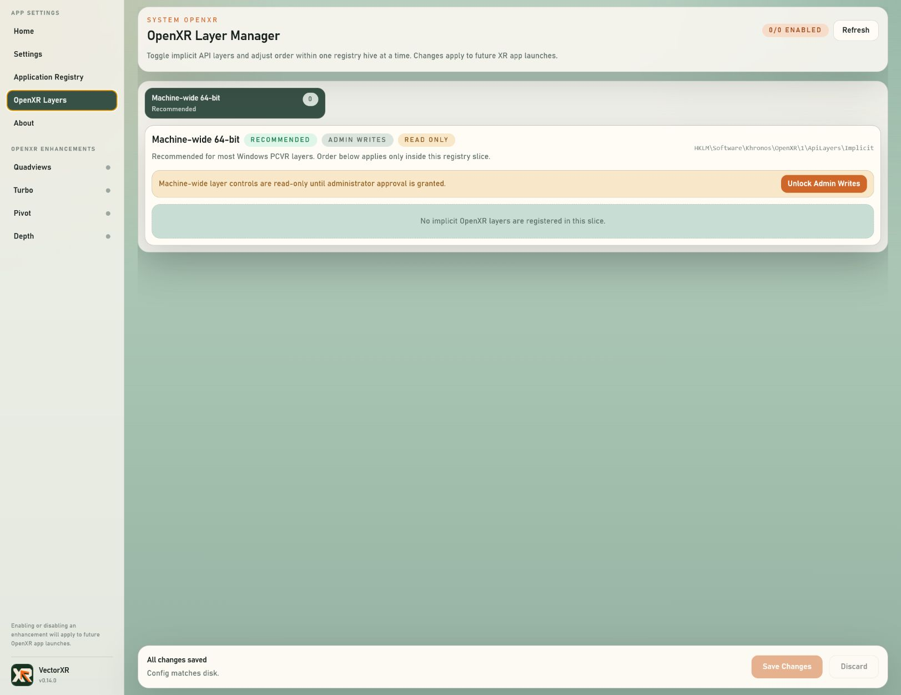

The **OpenXR Layers** tab manages the implicit API layers installed on your system across the
four Windows registry slices (Machine-wide / Per-user × 64-bit / 32-bit — *Machine-wide 64-bit*
is the recommended one for most PCVR). For each layer you can see its name, path, and signature
status, and you can enable, disable, reorder, or remove its registry registration.
Signature verification is optional: Refresh on this page requests it, with a
four-second limit per binary; startup readiness does not wait for verification. Removal asks
for confirmation and does not delete the layer's files from disk.

**Provider and order both matter.** When VectorXR provides Quadviews, disable
**Quad-Views-Foveated** so the two layers do not compete. If you intentionally use
Quad-Views-Foveated with VectorXR Pivot instead, keep the VectorXR Quadviews profile off and order
Quad-Views-Foveated **above VectorXR**. Official release builds are signed by **DienerTech LLC**;
local source builds may be unsigned. Signature status is shown after requesting verification.

## Updates

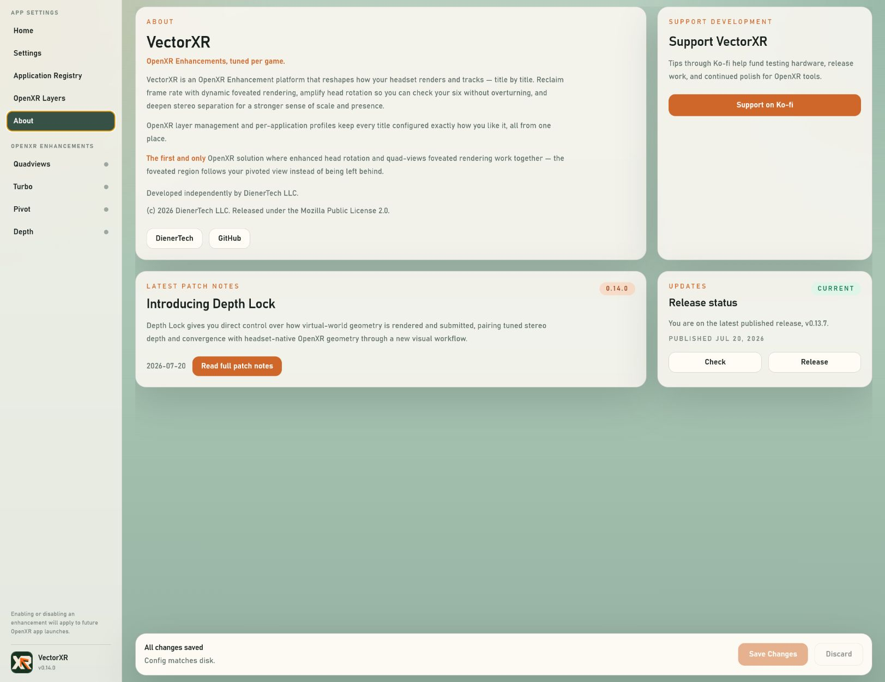

The **About** tab shows project info, support links, the latest patch notes, and a **Release
status** panel that checks GitHub for the newest published release. VectorXR does not auto-download
updates — install them manually from
[GitHub Releases](https://github.com/DienerTech/vectorxr/releases/latest).

**Join Discord** on Home and About loads the current DienerTech invitation online. The
button shows a loading state and stays disabled if the invitation is unavailable or the
request fails. Use **Retry** after reconnecting. The optional **VectorXR Updates** role in
Discord's **welcome-and-rules** channel lets you opt into release notifications.

## Disabling or removing VectorXR

VectorXR is designed to be reversible at every level:

- **Pause everything** — turn *VectorXR Enabled* off in Settings to stop all Enhancements without
  uninstalling.
- **Per Enhancement** — toggle any Enhancement off from the sidebar, or turn off its profiles.
- **Take it out of the pipeline** — disable the VectorXR layer from the OpenXR Layers tab.
- **Remove it** — uninstall from Windows to remove the app and unregister the API layer.
